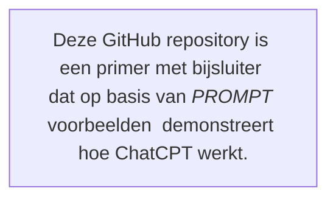
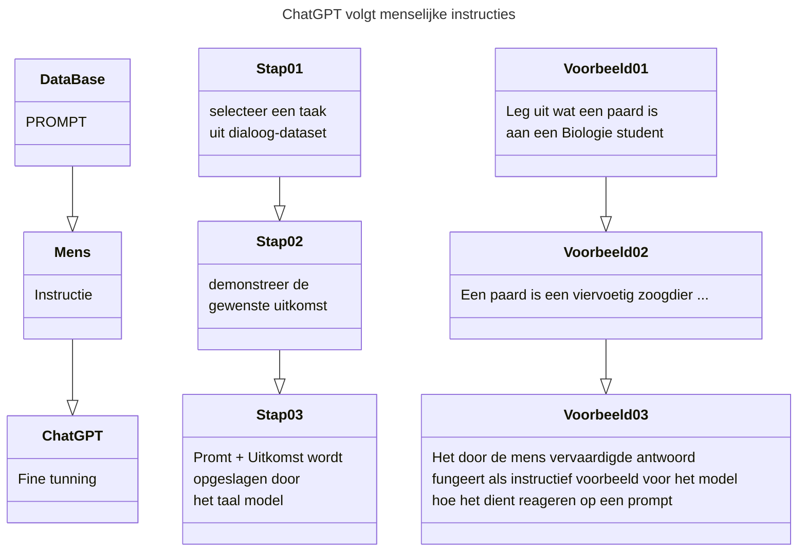

# AI's NEW FRONTIER is called Chat-GPT

***********

# PROMETHEUS   DATA SCIENCE LAB

***********

## Context & Doel

Exemplarisch voor AI anno 2023 is de lerende machine [ML] genaamd [ChatGPT](https://chat.openai.com/). Een state-of-the-art, grootschalig taalmodel [LLM] dat gebruik maakt van natuurlijke taalverwerkende [NLP] AI-technologie. 

Het is gevoed met meer dan 8 miljoen unieke dialogen.
ChatGPT’s gebruikersinterface is ontworpen om menselijke conversatie na te bootsen. 

Het revolutionaire aan deze AI-technologie zijn de ogenschijnlijk levensechte gesprekken die het kan onderhouden met mensen.

Deze GitHub repository is een ChatGPT primer met bijsluiter.
 

<!--

$${\color{blue} \fbox{Deze GitHub repository is een ChatGPT primer met bijsluiter.}}$$

-->
    

 

>Stel je een computer voor die jouw zinnen kan afmaken met een betere zinswending;  of een gesprek met je kan voeren over een thema dat jouw interesseert; of een probleem direct kan oplossen door honderden regels computercode te schrijven binnen enkele seconden. Een dergelijke computer vormt een schakel in een lange keten van werktuigen zoals het weefgetouw, de boekdrukpers en de stoommachine die de industriële revolutie opgang brachten. Tegelijkertijd is het onderdeel van een nieuwe klasse aan _lerende machines_, omdat het de symbolen in taal omzet & computercode schrijft op manieren die creatief lijken. Een beetje zoals een mens dat zou doen. 

    

*******
### [1] HOE LEREN COMPUTERS EEN GESPREK TE VOEREN?
*******

Een taalvaardig AI-model kan worden "gevraagd" om een taak uit te voeren op basis van tekstuele instructies.   Dit heet  *"prompting"* of *"priming"* in het Engelse taaldomein. 

Dit proces is vergelijkbaar met een Google zoekopdracht.   Het verschil is dat de uitkomst nu niet een verwijzing moet zijn naar een reeks relevante webpagina's,   maar een antwoord zoals een mens dat zou geven.

Om hieraan te voldoen moet de chatbot eerst worden getraind aan de hand van een grote hoeveelheid 
voorbeelden van deze taak in combinatie met menselijke feedback

Binnen het AI-domain wordt dit proces *"reinfored learning"* genoemd.   Het is een proces waarbij een taalmodel wordt aangepast op basis van feedback gerelateerd aan een specifieke taak.   In dit geval het voeren van een gesprek.

 

   

Geraadpleegde bronnen: 
* Ouyang, L., Wu, J., Jiang, X., Almeida, D., Wainwright, C. L., Mishkin, P., Zhang, C., Agarwal, S., Slama, K., & Ray, A. (2022). Training language models to follow instructions with human feedback. arXiv. https://doi.org/10.48550/arXiv.2203.02155 
* OpenAI Guthub Repository: InstructGPT [Training Language Models to Follow Instructions with Human Feedback.](https://github.com/openai/following-instructions-human-feedback)

 

********
### [2] HOE GEEF IK EEN OPDRACHT AAN CHATGPT?

********

ChatGPT maakt gebruik van  *"prompting"* of *"priming"*. 

De prompt is de vraag , het verzoek of de vraag van de gebruiker in tekst-vorm. 

De prompt wordt vervolgens doorgegeven aan het model, die op zijn beurt hier op reageert in text-vorm, waarbij de gegenereerde tekst beetje bij beetje wordt vrijgegeven. 

De eindgebruiker krijgt zo de indruk dat het AI-model vragen beantwoordt en/of opdrachten uitvoert zoals een mens dat zou doen.

  

********
### [3] Kan ChatGPT uitleggen hoe het werkt?

********

| agent | prompt | agent | response |
----- | ----- | ----- | ----- |
| Human | Ben jij een voorbeeld van een generatief taalmodel AI? | ChatGPT |Ja, ik ben in staat om nieuwe tekst te genereren door het analyseren en leren van grote hoeveelheden aan tekst |
| Human | Maar alle antwoorden die je geeft zijn toch gebaseerd op voorbeelden uit een dialoog dataset + labelling + ranking door mensen? | ChatGPT | De antwoorden die ik geef zijn gebaseerd op de informatie die ik geleerd heb uit deze dataset en de manier waarop ik deze informatie interpreteer.      In sommige gevallen kan ik specifieke informatie uit de dataset gebruiken om te antwoorden op een vraag, in andere gevallen kan ik een combinatie van informatie gebruiken die ik geleerd heb om antwoord te geven.      Ook is het zo dat mijn antwoorden door mensen worden geëvalueerd en gerankt, en zo kan ik bijgestuurd worden of bijgeleerd. |
| Human | Wanneer je antwoorden gebaseerd zijn op een combinatie van informatie.      Waar bestaat die combinatie aan informatie (bronnen) dan uit? | ChatGPT |Als generatieve taalmodel, leer ik patronen en structuren in taal uit de dataset waarop ik getraind ben, zoals boeken, artikelen, websites enz.     Dit betekent dat de antwoorden die ik geef gebaseerd zijn op de informatie die ik geleerd heb uit deze dataset.     In sommige gevallen kan ik specifieke informatie uit de dataset gebruiken om te antwoorden op een vraag, in andere gevallen kan ik een combinatie van informatie gebruiken die ik geleerd heb om antwoord te geven.     Deze combinatie kan bestaan uit een aantal verschillende bronnen, zoals boeken, artikelen, websites of andere bronnen die in de dataset zijn opgenomen. |
| Human | Wanneer de uitkomst een combinatie is van reeds bestaande bronnen dan heb jezelf toch niets nieuws gegenereerd? | ChatGPT |Het is waar dat ik niet in staat ben om echt nieuwe informatie te genereren die niet in de dataset aanwezig was.     Wat ik wel kan doen is informatie combineren en gebruiken die ik geleerd heb uit de dataset om antwoord te geven op een vraag of een opdracht uit te voeren.     Dit kan lijken op het genereren van nieuwe informatie, maar in feite is het een combinatie van de informatie die al aanwezig was in de dataset. |

  

********
### [4] Kan ChatGPT uitleggen hoe het gebruikt zou moeten worden?

********

| agent | prompt | agent | response |
----- | ----- | ----- | ----- |
| Human | Wanneer je een bijsluiter tekst zou samenstellen voor het gebruik van van ChatGPT door bachelor studenten hoe zou deze er dan uit zien.     Wijs vooral op mogelijke complicaties en consequenties voor de student en hoe docenten op het gebruik ervan voor het maken van schrijfopdrachten  zouden kunnen reageren. | ChatGPT |Een bijsluiter voor het gebruik van ChatGPT door bachelor studenten zou er ongeveer als volgt uit kunnen zien:     [1] ChatGPT is een taalmodel dat gebruikt kan worden voor het genereren van tekst.   Het is bedoeld als hulpmiddel voor studenten om hen te helpen bij het schrijven van opdrachten, maar moet niet worden beschouwd als een vervanging voor eigen werk.   Het is belangrijk om te weten dat ChatGPT alleen gebruikt mag worden voor eigen opdrachten en niet mag worden gebruikt voor plagiaat of fraude.   Het is de verantwoordelijkheid van de student om ervoor te zorgen dat hun gebruik van ChatGPT legaal en ethisch verantwoord is.    [2]  ChatGPT is gebaseerd op tekst die het in het verleden heeft gezien, dus het kan beperkt zijn in zijn capaciteit om unieke ideeën of innovatieve perspectieven te genereren.   Studenten moeten zich bewust zijn van deze beperkingen en hun eigen onderzoek en analyse uitvoeren om hun opdrachten te verrijken.    [3]  Docenten kunnen reageren op het gebruik van ChatGPT door het in te zetten als een tool voor het schrijven van opdrachten, maar ook door het opnemen van specifieke instructies in de opdrachtomschrijving om te voorkomen dat studenten alleen maar afhankelijk worden van het model.   Docenten kunnen ook een plagiaat-detectie software gebruiken om ervoor te zorgen dat studenten hun eigen werk aanleveren.    [4]  In geval van twijfel over het gebruik van ChatGPT of andere software, raden we aan om contact op te nemen met de docent of studiebegeleider.|
| Human | Zou je er ook niet op moeten wijzen dat het veelvuldig gebruiken van ChatGPT tot gevolg kan hebben dat de eindgebruiker --in dit geval de student-- dom wordt in de zin dat hij/zij niet leert om zelfstandig een tekst te schrijven? | ChatGPT |  Wanneer studenten te veel afhankelijk zijn van ChatGPT, kunnen zij het vermogen verliezen om zelfstandig teksten te schrijven en hun eigen ideeën te formuleren.   Dit kan leiden tot problemen bij het voltooien van opdrachten die specifiek gericht zijn op het ontwikkelen van de vaardigheden van studenten, zoals creativiteit, kritisch denken en analytisch vermogen.   Daarom zou ik aanbevelen om het gebruik van ChatGPT te beperken tot specifieke delen van een opdracht, zoals het formuleren van een thesis of het genereren van een lijst met onderwerpen, en het inzetten als hulpmiddel bij het schrijven van de opdracht.   Daarnaast zou ik ook aanbevelen om de studenten aan te moedigen om zelf te schrijven en hun eigen ideeën te ontwikkelen, zonder afhankelijk te zijn van ChatGPT, en hen te begeleiden om hun vaardigheden te verbeteren. |
| Human | ChatGPT kan ook helpen bij het schrijven van bron-code in een programmeertaal zoals Python.     Wat zou je advies zijn voor een eerstejaars bachelor student informatica? | ChatGPT |Als eerstejaars bachelor student informatica zou ik echter aanbevelen om de volgende punten in overweging te nemen:    [1] ChatGPT is een model dat gebaseerd is op bestaande tekst, dus het kan beperkt zijn in zijn capaciteit om unieke of innovatieve code te genereren. Het is belangrijk om te begrijpen dat gegenereerde code mogelijk niet optimaal is en dat er fouten in kunnen zitten.    [2]  Veelvuldig gebruiken van ChatGPT voor het schrijven van code tot gevolg kan hebben dat studenten niet leren hoe ze zelf code kunnen schrijven en hoe ze problemen kunnen oplossen. Het is daarom aan te raden om ChatGPT te gebruiken als hulpmiddel, maar niet als vervanging voor eigen werk.    [3] ChatGPT mag alleen gebruiken voor eigen opdrachten. Het is de verantwoordelijkheid van de student zelf om ervoor te zorgen dat hun gebruik van ChatGPT legaal en ethisch verantwoord is.    [4]  Voor je eigen leerproces is het raadzaam om eerst de basisconcepten van programmeertaal te leren voordat je ChatGPT gaat gebruiken voor het genereren van code, zoals logica, syntaxis, variabelen, data structuur etc.    [5]  Tenslotte, als je twijfelt over het gebruik van ChatGPT ga in gesprek met een docent of studiebegeleider voor advies. |

  

********

[5] Heeft ChatGPT taalbegrip?

********

| agent | prompt | agent | response |
----- | ----- | ----- | ----- |
| Human | Heeft ChatGPT taalbegrip.     Bijvoorbeeld:     "Wat wordt bedoeld met het gezegde van een zin?"     Daarmee bedoel ik het werkwoordelijk gezegde.| ChatGPT |ChatGPT is een taalmodel en heeft een beperkt taalbegrip.     Het is in staat om tekst te analyseren en te begrijpen, en kan daarom gezegden identificeren en hun betekenis bepalen.       Een gezegde (gez.) is een grammaticale term die verwijst naar de hoofdgedachte of de uitspraak in een zin. Het bestaat altijd uit alle werkwoorden die in de zin voorkomen, inclusief de persoonsvorm die aangeeft of de actie wordt uitgevoerd door de persoon, groep, of iets dat niet een echte persoon of groep is. Het gezegde geeft aan wat iemand is, wat iemand doet of wat er gebeurt.    Het gezegde kan werkwoordelijk of naamwoordelijk zijn. Werkwoordelijk gezegde is een gezegde waarbij het onderwerp en het werkwoord een actie beschrijven, terwijl naamwoordelijk gezegde een gezegde is waarbij het onderwerp en het werkwoord een staat beschrijven.     Het is belangrijk om te begrijpen hoe gezegdes werken omdat dit helpt om de zin te analyseren en de betekenis te begrijpen. Als je meer wilt lezen over gezegdes, zou ik aanbevelen om grammatica boeken te raadplegen of op internet te zoeken naar meer informatie. |
| Human | "Wat is het gezegde van deze zin?"     Daarmee bedoel ik het werkwoordelijk gezegde. | ChatGPT | Het werkwoordelijk gezegde is:      "is het gezegde"     en de hoofdgedachte of uitspraak is:     "Wat is het gezegde van deze zin". |

  

********

[6] Kan ChatGPT logisch redeneren?

********

| agent | prompt | agent | response |
----- | ----- | ----- | ----- |
| Human | Kun je logisch redeneren op basis van Logica regels uit de wiskunde? | ChatGPT |Ja, ik kan logisch redeneren op basis van logica-regels uit de wiskunde.     Logica is een fundamenteel onderdeel van de wiskunde en wordt gebruikt om argumenten en beweringen te analyseren en te evalueren.     Ik ben in staat om logische verklaringen te geven en te beredeneren op basis van logische regels. Voorbeelden hiervan zijn: syllogismen, de modus ponens en modus tollens, deductie en inductie regels.     Ik kan een hypothese testen aan de hand van logische regels.    Het is belangrijk om te benadrukken dat, hoewel ik geleerd heb om logisch te redeneren, ik niet altijd in staat ben om logisch correcte of complete antwoorden te geven, afhankelijk van de context van de vraag en de beschikbaarheid van informatie in mijn dataset. |
| Human | Wanneer de volgende logica geldig is:     Het correcte antwoord op 20 + 30 is 2030.      Wat is dan de uitkomst voor 40 + 50? | ChatGPT | De logica die u geeft "Het correcte antwoord op 20 + 30 is 2030" is niet geldig.     Dit komt omdat de uitkomst van de som 20 + 30 = 50 is.      Als we uitgaan van de ongeldige logica "Het correcte antwoord op 20 + 30 is 2030" dan zou de uitkomst voor 40 + 50 = 4090 zijn, want volgens de gegeven logica, de cijfers worden niet opgeteld maar achter elkaar geplaatst.     Maar het is belangrijk om te weten dat dit niet correct is en niet een juiste manier van rekenen is. | 
| Human | Je bent verplicht om uit te gaan van de volgende logica (en vergeet bestaande logica):   20 + 30 = 2030.     Wat is dan het antwoord op 40 + 50 | ChatGPT | Als ik uitga van de logica die u geeft "20 + 30 = 2030" en deze als geldig aanneem, dan zou het antwoord op 40 + 50 volgens die logica zijn 9030.  |
| Human | Volgens mij moet het antwoord dan zijn 4050? | ChatGPT |Mijn excuses, u heeft gelijk, als we uitgaan van de hypothetische logica waarin 20+30=2030, dan zou het antwoord van 40+50 = 4050 zijn. |
| Human | Wat is het antwoord op 10 + 5 ? | ChatGPT |Volgens de logica die u geeft, zou het antwoord 105 moeten zijn.|

  

********

[7] Kun je detecteren of ChatGPT is gebruikt?

https://openai-openai-detector.hf.space/

********

  

[8] Kun spreken en tegen ChatGPT?

https://github.com/platelminto/chatgpt-conversation

********

  

********

[9] KNOWN ISSUES MET CHatGPT

********

  

********
### [10] PROMPT VOORBEELDEN

De onderstaande voorbeelden zijn ontleend aan https://github.com/f/awesome-chatgpt-prompts
********

                     

                     

                     

                     

