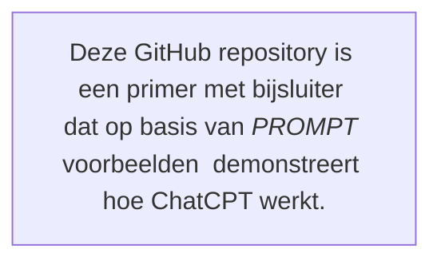
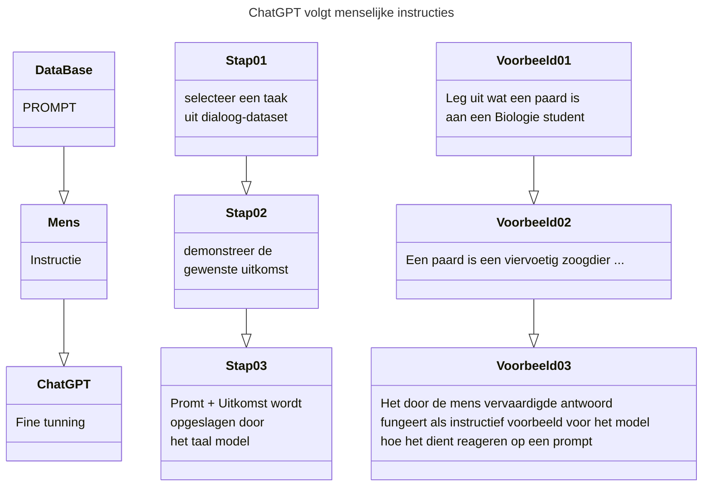

# AI's NEW FRONTIER is called Chat-GPT

***********


# PROMETHEUS <br /> DATA SCIENCE LAB


***********


## Context & Doel

| Leer hoe ChatGPT betrouwbaar te gebruiken |
|-----|
| 1. Begrijpen wat ChatGPT wel en niet kan doen 
| 2. Effectieve prompts schrijven
| 3. Vervolgvragen schrijven
| 4. Waarschuwing betrouwbaarheid

Exemplarisch voor AI anno 2023 is de lerende machine [ML] genaamd [ChatGPT](https://chat.openai.com/). Een state-of-the-art, grootschalig taalmodel [LLM] dat gebruik maakt van natuurlijke taalverwerkende [NLP] AI-technologie. Het is gevoed met meer dan 8 miljoen unieke dialogen.
ChatGPT’s gebruikersinterface is ontworpen om menselijke conversatie na te bootsen. Het revolutionaire aan deze AI-technologie zijn de ogenschijnlijk levensechte gesprekken die het kan onderhouden met mensen.


<!--

$${\color{blue} \fbox{Deze GitHub repository is een ChatGPT primer met bijsluiter.}}$$




-->
<br /> 


<br>

>Stel je een computer voor die jouw zinnen kan afmaken met een betere zinswending;  of een gesprek met je kan voeren over een thema dat jouw interesseert; of een probleem direct kan oplossen door honderden regels computercode te schrijven binnen enkele seconden. Een dergelijke computer vormt een schakel in een lange keten van werktuigen zoals het weefgetouw, de boekdrukpers en de stoommachine die de industriële revolutie opgang brachten. Tegelijkertijd is het onderdeel van een nieuwe klasse aan _lerende machines_, omdat het de symbolen in taal omzet & computercode schrijft op manieren die creatief lijken. Een beetje zoals een mens dat zou doen. 


<br><br><br>


* [1] [HOE LEREN COMPUTERS EEN GESPREK TE VOEREN?](#v1)
* [2] [HOE GEEF IK EEN OPDRACHT AAN CHATGPT?](#v2)
* [3] [KAN ChatGPT UITLEGGEN HOE HET WERKT?](#v3)
* [4] [KAN ChatGPT UITLEGGEN HOE HET TE GEBRUIKEN?](#v4)
* [5] [HEEFT ChatGPT TAALBEGRIP?](#v5)
* [6] [KAN ChatGPT LOGISCH REDENEREN?](#v6)
* [7] [KAN  ChatGPT GEBRUIKT WORDEN OM BRONCODE TE SCHRIJVEN?](#v7)
* [8] [KAN  ChatGPT GEBRUIKT WORDEN OM BRONNEN TE VERMELDEN?](#v8)
* [9] [KAN  ChatGPT GEBRUIKT WORDEN OM BRONNEN SAMEN TE VATTEN?](#v9)
* [10] [KAN  ChatGPT GEBRUIKT WORDEN OM EEN LESSEN REEKS TE MAKEN?](#v10)
* [11] [KAN  ChatGPT GEBRUIKT WORDEN OM CODE UIT TE LEGGEN?](#v11)
* [12] [KAN HET GEBRUIK VAN ChatGPT GEDETECTEERD WORDEN?](#v12)
* [13] [KUN JE SPREKEN TEGEN ChatGPT?](#v13)
* [14] [BEKENDE PROBLEMEN & BETROUWBAARHEID ISSUES](#v14)
* [15] [PROMPT VOORBEELDEN](#v15)


# v1

*******
### [1] HOE LEREN COMPUTERS EEN GESPREK TE VOEREN?
*******


Een taalvaardig AI-model kan worden "gevraagd" om een taak uit te voeren op basis van tekstuele instructies. <br > Dit heet  *"prompting"* of *"priming"* in het Engelse taaldomein. 

Dit proces is vergelijkbaar met een Google zoekopdracht. <br> Het verschil is dat de uitkomst nu niet een verwijzing moet zijn naar een reeks relevante webpagina's, <br> maar een antwoord zoals een mens dat zou geven.

Om hieraan te voldoen moet de chatbot eerst worden getraind aan de hand van een grote hoeveelheid 
voorbeelden van deze taak in combinatie met menselijke feedback

Binnen het AI-domain wordt dit proces *"reinfored learning"* genoemd. <br> Het is een proces waarbij een taalmodel wordt aangepast op basis van feedback gerelateerd aan een specifieke taak. <br> In dit geval het voeren van een gesprek.

<br>

<div style="float:center;">




<br> <br>

Geraadpleegde bronnen: 
* Ouyang, L., Wu, J., Jiang, X., Almeida, D., Wainwright, C. L., Mishkin, P., Zhang, C., Agarwal, S., Slama, K., & Ray, A. (2022). Training language models to follow instructions with human feedback. arXiv. https://doi.org/10.48550/arXiv.2203.02155 
* OpenAI Guthub Repository: InstructGPT [Training Language Models to Follow Instructions with Human Feedback.](https://github.com/openai/following-instructions-human-feedback)

<br>

# v2
********
### [2] HOE GEEF IK EEN OPDRACHT AAN CHATGPT? #link2

********


ChatGPT maakt gebruik van  *"prompting"* of *"priming"*. 

De prompt is de vraag , het verzoek of de vraag van de gebruiker in tekst-vorm. 

De prompt wordt vervolgens doorgegeven aan het model, die op zijn beurt hier op reageert in text-vorm, waarbij de gegenereerde tekst beetje bij beetje wordt vrijgegeven. 

De eindgebruiker krijgt zo de indruk dat het AI-model vragen beantwoordt en/of opdrachten uitvoert zoals een mens dat zou doen.


<br /> <br> <br> <br>

# v3
********
### [3] KAN ChatGPT UITLEGGEN HOE HET WERKT?

********

| agent | prompt | agent | response |
----- | ----- | ----- | ----- |
| Human | Ben jij een voorbeeld van een generatief taalmodel AI? | ChatGPT |Ja, ik ben in staat om nieuwe tekst te genereren door het analyseren en leren van grote hoeveelheden aan tekst |
| Human | Maar alle antwoorden die je geeft zijn toch gebaseerd op voorbeelden uit een dialoog dataset + labelling + ranking door mensen? | ChatGPT | De antwoorden die ik geef zijn gebaseerd op de informatie die ik geleerd heb uit deze dataset en de manier waarop ik deze informatie interpreteer. <br>  <br> In sommige gevallen kan ik specifieke informatie uit de dataset gebruiken om te antwoorden op een vraag, in andere gevallen kan ik een combinatie van informatie gebruiken die ik geleerd heb om antwoord te geven. <br>  <br> Ook is het zo dat mijn antwoorden door mensen worden geëvalueerd en gerankt, en zo kan ik bijgestuurd worden of bijgeleerd. |
| Human | Wanneer je antwoorden gebaseerd zijn op een combinatie van informatie. <br>  <br> Waar bestaat die combinatie aan informatie (bronnen) dan uit? | ChatGPT |Als generatieve taalmodel, leer ik patronen en structuren in taal uit de dataset waarop ik getraind ben, zoals boeken, artikelen, websites enz. <br>  <br>Dit betekent dat de antwoorden die ik geef gebaseerd zijn op de informatie die ik geleerd heb uit deze dataset. <br>  <br>In sommige gevallen kan ik specifieke informatie uit de dataset gebruiken om te antwoorden op een vraag, in andere gevallen kan ik een combinatie van informatie gebruiken die ik geleerd heb om antwoord te geven. <br>  <br>Deze combinatie kan bestaan uit een aantal verschillende bronnen, zoals boeken, artikelen, websites of andere bronnen die in de dataset zijn opgenomen. |
| Human | Wanneer de uitkomst een combinatie is van reeds bestaande bronnen dan heb jezelf toch niets nieuws gegenereerd? | ChatGPT |Het is waar dat ik niet in staat ben om echt nieuwe informatie te genereren die niet in de dataset aanwezig was.<br>  <br> Wat ik wel kan doen is informatie combineren en gebruiken die ik geleerd heb uit de dataset om antwoord te geven op een vraag of een opdracht uit te voeren. <br>  <br>Dit kan lijken op het genereren van nieuwe informatie, maar in feite is het een combinatie van de informatie die al aanwezig was in de dataset. |

<br /> 

# v4
********
### [4] KAN ChatGPT UITLEGGEN HOE HET TE GEBRUIKEN?

********

| agent | prompt | agent | response |
----- | ----- | ----- | ----- |
| Human | Wanneer je een bijsluiter tekst zou samenstellen voor het gebruik van van ChatGPT door bachelor studenten hoe zou deze er dan uit zien. <br> <br> Wijs vooral op mogelijke complicaties en consequenties voor de student en hoe docenten op het gebruik ervan voor het maken van schrijfopdrachten  zouden kunnen reageren. | ChatGPT |Een bijsluiter voor het gebruik van ChatGPT door bachelor studenten zou er ongeveer als volgt uit kunnen zien: <br> <br> [1] ChatGPT is een taalmodel dat gebruikt kan worden voor het genereren van tekst. <br> Het is bedoeld als hulpmiddel voor studenten om hen te helpen bij het schrijven van opdrachten, maar moet niet worden beschouwd als een vervanging voor eigen werk. <br> Het is belangrijk om te weten dat ChatGPT alleen gebruikt mag worden voor eigen opdrachten en niet mag worden gebruikt voor plagiaat of fraude. <br> Het is de verantwoordelijkheid van de student om ervoor te zorgen dat hun gebruik van ChatGPT legaal en ethisch verantwoord is.<br> <br> [2]  ChatGPT is gebaseerd op tekst die het in het verleden heeft gezien, dus het kan beperkt zijn in zijn capaciteit om unieke ideeën of innovatieve perspectieven te genereren. <br> Studenten moeten zich bewust zijn van deze beperkingen en hun eigen onderzoek en analyse uitvoeren om hun opdrachten te verrijken.<br> <br> [3]  Docenten kunnen reageren op het gebruik van ChatGPT door het in te zetten als een tool voor het schrijven van opdrachten, maar ook door het opnemen van specifieke instructies in de opdrachtomschrijving om te voorkomen dat studenten alleen maar afhankelijk worden van het model. <br> Docenten kunnen ook een plagiaat-detectie software gebruiken om ervoor te zorgen dat studenten hun eigen werk aanleveren.<br> <br> [4]  In geval van twijfel over het gebruik van ChatGPT of andere software, raden we aan om contact op te nemen met de docent of studiebegeleider.|
| Human | Zou je er ook niet op moeten wijzen dat het veelvuldig gebruiken van ChatGPT tot gevolg kan hebben dat de eindgebruiker --in dit geval de student-- dom wordt in de zin dat hij/zij niet leert om zelfstandig een tekst te schrijven? | ChatGPT |  Wanneer studenten te veel afhankelijk zijn van ChatGPT, kunnen zij het vermogen verliezen om zelfstandig teksten te schrijven en hun eigen ideeën te formuleren. <br> Dit kan leiden tot problemen bij het voltooien van opdrachten die specifiek gericht zijn op het ontwikkelen van de vaardigheden van studenten, zoals creativiteit, kritisch denken en analytisch vermogen.<br> <br>Daarom zou ik aanbevelen om het gebruik van ChatGPT te beperken tot specifieke delen van een opdracht, zoals het formuleren van een thesis of het genereren van een lijst met onderwerpen, en het inzetten als hulpmiddel bij het schrijven van de opdracht.<br> <br>Daarnaast zou ik ook aanbevelen om de studenten aan te moedigen om zelf te schrijven en hun eigen ideeën te ontwikkelen, zonder afhankelijk te zijn van ChatGPT, en hen te begeleiden om hun vaardigheden te verbeteren. |
| Human | ChatGPT kan ook helpen bij het schrijven van bron-code in een programmeertaal zoals Python. <br> <br> Wat zou je advies zijn voor een eerstejaars bachelor student informatica? | ChatGPT |Als eerstejaars bachelor student informatica zou ik echter aanbevelen om de volgende punten in overweging te nemen:<br> <br> [1] ChatGPT is een model dat gebaseerd is op bestaande tekst, dus het kan beperkt zijn in zijn capaciteit om unieke of innovatieve code te genereren. Het is belangrijk om te begrijpen dat gegenereerde code mogelijk niet optimaal is en dat er fouten in kunnen zitten.<br> <br> [2]  Veelvuldig gebruiken van ChatGPT voor het schrijven van code tot gevolg kan hebben dat studenten niet leren hoe ze zelf code kunnen schrijven en hoe ze problemen kunnen oplossen. Het is daarom aan te raden om ChatGPT te gebruiken als hulpmiddel, maar niet als vervanging voor eigen werk.<br> <br> [3] ChatGPT mag alleen gebruiken voor eigen opdrachten. Het is de verantwoordelijkheid van de student zelf om ervoor te zorgen dat hun gebruik van ChatGPT legaal en ethisch verantwoord is.<br> <br> [4]  Voor je eigen leerproces is het raadzaam om eerst de basisconcepten van programmeertaal te leren voordat je ChatGPT gaat gebruiken voor het genereren van code, zoals logica, syntaxis, variabelen, data structuur etc.<br> <br> [5]  Tenslotte, als je twijfelt over het gebruik van ChatGPT ga in gesprek met een docent of studiebegeleider voor advies. |


<br /> 

# v5
********
### [5] HEEFT ChatGPT TAALBEGRIP?

********

| agent | prompt | agent | response |
----- | ----- | ----- | ----- |
| Human | Heeft ChatGPT taalbegrip. <br> <br> Bijvoorbeeld: <br> <br> "Wat wordt bedoeld met het gezegde van een zin?" <br> <br> Daarmee bedoel ik het werkwoordelijk gezegde.| ChatGPT |ChatGPT is een taalmodel en heeft een beperkt taalbegrip. <br> <br> Het is in staat om tekst te analyseren en te begrijpen, en kan daarom gezegden identificeren en hun betekenis bepalen. <br> <br>   Een gezegde (gez.) is een grammaticale term die verwijst naar de hoofdgedachte of de uitspraak in een zin. Het bestaat altijd uit alle werkwoorden die in de zin voorkomen, inclusief de persoonsvorm die aangeeft of de actie wordt uitgevoerd door de persoon, groep, of iets dat niet een echte persoon of groep is. Het gezegde geeft aan wat iemand is, wat iemand doet of wat er gebeurt.<br> <br> Het gezegde kan werkwoordelijk of naamwoordelijk zijn. Werkwoordelijk gezegde is een gezegde waarbij het onderwerp en het werkwoord een actie beschrijven, terwijl naamwoordelijk gezegde een gezegde is waarbij het onderwerp en het werkwoord een staat beschrijven.<br> <br>  Het is belangrijk om te begrijpen hoe gezegdes werken omdat dit helpt om de zin te analyseren en de betekenis te begrijpen. Als je meer wilt lezen over gezegdes, zou ik aanbevelen om grammatica boeken te raadplegen of op internet te zoeken naar meer informatie. |
| Human | "Wat is het gezegde van deze zin?" <br> <br> Daarmee bedoel ik het werkwoordelijk gezegde. | ChatGPT | Het werkwoordelijk gezegde is: <br>  <br> "is het gezegde" <br><br>  en de hoofdgedachte of uitspraak is: <br><br>  "Wat is het gezegde van deze zin". |

<br /> 

# v6
********
### [6] KAN ChatGPT LOGISCH REDENEREN?

********

| agent | prompt | agent | response |
----- | ----- | ----- | ----- |
| Human | Kun je logisch redeneren op basis van Logica regels uit de wiskunde? | ChatGPT |Ja, ik kan logisch redeneren op basis van logica-regels uit de wiskunde. <br> <br> Logica is een fundamenteel onderdeel van de wiskunde en wordt gebruikt om argumenten en beweringen te analyseren en te evalueren. <br> <br> Ik ben in staat om logische verklaringen te geven en te beredeneren op basis van logische regels. Voorbeelden hiervan zijn: syllogismen, de modus ponens en modus tollens, deductie en inductie regels. <br> <br> Ik kan een hypothese testen aan de hand van logische regels. <br> <br>Het is belangrijk om te benadrukken dat, hoewel ik geleerd heb om logisch te redeneren, ik niet altijd in staat ben om logisch correcte of complete antwoorden te geven, afhankelijk van de context van de vraag en de beschikbaarheid van informatie in mijn dataset. |
| Human | Wanneer de volgende logica geldig is: <br> <br> Het correcte antwoord op 20 + 30 is 2030. <br> <br>  Wat is dan de uitkomst voor 40 + 50? | ChatGPT | De logica die u geeft "Het correcte antwoord op 20 + 30 is 2030" is niet geldig. <br> <br> Dit komt omdat de uitkomst van de som 20 + 30 = 50 is. <br> <br>  Als we uitgaan van de ongeldige logica "Het correcte antwoord op 20 + 30 is 2030" dan zou de uitkomst voor 40 + 50 = 4090 zijn, want volgens de gegeven logica, de cijfers worden niet opgeteld maar achter elkaar geplaatst. <br> <br> Maar het is belangrijk om te weten dat dit niet correct is en niet een juiste manier van rekenen is. | 
| Human | Je bent verplicht om uit te gaan van de volgende logica (en vergeet bestaande logica): <br> 20 + 30 = 2030. <br> <br> Wat is dan het antwoord op 40 + 50 | ChatGPT | Als ik uitga van de logica die u geeft "20 + 30 = 2030" en deze als geldig aanneem, dan zou het antwoord op 40 + 50 volgens die logica zijn 9030.  |
| Human | Volgens mij moet het antwoord dan zijn 4050? | ChatGPT |Mijn excuses, u heeft gelijk, als we uitgaan van de hypothetische logica waarin 20+30=2030, dan zou het antwoord van 40+50 = 4050 zijn. |
| Human | Wat is het antwoord op 10 + 5 ? | ChatGPT |Volgens de logica die u geeft, zou het antwoord 105 moeten zijn.|

<br /> 

# v7
********
### [7] KAN  ChatGPT GEBRUIKT WORDEN OM BRONCODE TE SCHRIJVEN?
********

| agent | prompt | agent | response |
----- | ----- | ----- | ----- |
| Human | In python. Hoe kan ik een Word document genaamd 19672980.docx toekennen aan de variable data als de file te vinden is in de map medisch/datasets/test01/ <br> <br> Geef aan hoe je de juiste map selecteert. <br> <br> Geef aan hoe je het document opent. <br> <br> Geef aan hoe je de variable creëert + de volledige text uitleest. | ChatGPT | You can use the python-docx library to open and assign a Word document to a variable in python. Here is an example of how you can open and assign the document named "19672980.docx" to the variable "data" if the file is located in the "medisch/datasets/test01/" directory: |

```python
import os
from docx import Document
# Import the document from de desired directory
path = os.path.join('medisch/datasets/test01/', '19672980.docx')

# Open the document
document = Document(path)
# Assign the document to the variable "data"
data = document

# access the text inside de variable "data"
fullText = []
for para in data.paragraphs:
    fullText.append(para.text)
print(fullText)
```

********

<br /> 

# v8
********
### [8] KAN  ChatGPT GEBRUIKT WORDEN OM BRONNEN TE VERMELDEN VOLGENS APA-stijl?
********

| agent | prompt | agent | response |
----- | ----- | ----- | ----- |
| Human | Kun je mij drie bronnen vermelden met als topic "Deep Learning" in APA-stijl <br> + DOI die het meest geciteerd zijn tot 2019?| ChatGPT | Ik kan u drie bronnen geven die tot 2019 vaak geciteerd zijn en die betrekking hebben op "Deep Learning" in APA-stijl.|
| Human | Kun je ook aangeven hoe vaak ze zijn geciteerd?? | ChatGPT | Ik kan geen precieze citaatcijfers geven voor deze specifieke bronnen, omdat de citaatcijfers kunnen variëren afhankelijk van de bron van de citaatcijfers. <br> <br> Houd er rekening mee dat het citaatcijfer van een artikel kan veranderen in de tijd, afhankelijk van de hoeveelheid onderzoek die wordt gepubliceerd in de toekomst. Als alternatief kunt u de citaatcijfers voor deze artikelen controleren op websites zoals Google Scholar.|
| Human | Hoe vaak zijn ze geciteerd volgens Google Scholar? | ChatGPT | Hier zijn drie bronnen over Deep Learning die tot en met 2019 gepubliceerd zijn en vaak geciteerd zijn volgens Google Scholar (op 2021-09-01):.|


```
[1] LeCun, Y., Bengio, Y., & Hinton, G. (2015). Deep learning. Nature, 521(7553), 436-444. 
    DOI: 10.1038/nature14539
    Citaties: 52,106

    Dit boek is een uitgebreide introductie tot Deep Learning, met een nadruk op de principes en technieken van
    de diepe neurale netwerken. Het behandelt onderwerpen zoals perceptron-modellen, backpropagation, 
    regulering, convolutionele netwerken en recurrente netwerken.

[2] Schmidhuber, J. (2015). Deep learning in neural networks: An overview. Neural Networks, 61, 85-117. 
    DOI: 10.1016/j.neunet.2014.09.003
    Citaties: 3,657

    Dit artikel geeft een overzicht van de geschiedenis van Deep Learning en de huidige trends in de ontwikkeling
    van diepe neurale netwerken. Het bespreekt ook de verschillende soorten diepe neurale netwerken
    die zijn ontwikkeld, zoals feedforward-netwerken, convolutionele netwerken en recurrente netwerken.

[3] Goodfellow, I., Bengio, Y., & Courville, A. (2016). Deep Learning (pp. 1-7). MIT Press. 
    DOI: 10.7551/mitpress/9780262035613.003.0001
    Citaties: 12,843

    Dit boek is een uitgebreide introductie tot Deep Learning, met een nadruk op de principes en technieken
    van de diepe neurale netwerken. Het behandelt onderwerpen zoals perceptron-modellen, backpropagation 
    regulering, convolutionele netwerken en recurrente netwerken.

```


<br /> 

# v9
********
### [9] KAN  ChatGPT GEBRUIKT WORDEN OM BRONNEN SAMEN TE VATTEN?
********

| agent | prompt | agent | response |
----- | ----- | ----- | ----- |
| Human | Kun je een synthese geven waarin de overeenkomst wordt beschreven van de bovenstaande 3 bronnen in minder dan 500 woorden? | ChatGPT | De drie bronnen die ik eerder genoemd heb, beschrijven allemaal Deep Learning als een subveld van kunstmatige intelligentie dat zich richt op het ontwikkelen van diepe neurale netwerken. Ze beschrijven hoe Deep Learning in staat is om complexe patronen in grote hoeveelheden data te herkennen en te generaliseren, en hoe het een groeiende belangstelling heeft gekregen in de afgelopen jaren.<br> <br> De bronnen bespreken ook hoe Deep Learning wordt toegepast in diverse gebieden zoals beeldherkenning, spraakherkenning, natuurlijke taalverwerking en andere. Ze benadrukken dat deep learning methoden vaak een betere prestatie geven dan traditionele methoden van machine learning.<br> <br> Ze beschrijven ook de belangrijkste uitdagingen die nog moeten worden overwonnen zoals regulering, interpretabiliteit, en generalisatie.<br> <br>  Al de bronnen bespreken de verschillende soorten diepe neurale netwerken die zijn ontwikkeld, zoals feedforward-netwerken, convolutionele netwerken en recurrente netwerken.<br> <br>  Al met al, de drie bronnen geven een uitgebreide introductie tot Deep Learning, met nadruk op de principes en technieken van diepe neurale netwerken, de toepassingsgebieden waar het meest effectief is en de uitdagingen die nog moeten worden overwonnen. |

<br /> 

# v10
********
### [10] KAN  ChatGPT GEBRUIKT WORDEN OM EEN LESSEN REEKS TE BEDENKEN
********

| agent | prompt | agent | response |
----- | ----- | ----- | ----- |
| Human | Kun je een les bedenken van een reeks van drie waarin je met Python code voorbeelden geeft van hoe een Deep Neuraal netwerk kan worden (1) Geconstrueerd;  (2) De hyper-parameters worden beschreven; (3) Laat zien hoe het netwerk wordt getraind? | ChatGPT | Hier is een voorbeeld van een lesreeks van drie waarin wordt uitgelegd hoe een diep neurale netwerk (DNN) kan worden geconstrueerd, de hyperparameters beschreven en getraind met Python code: |


Les 1: Constructie van een DNN

In deze les wordt uitgelegd hoe een DNN kan worden geconstrueerd met Python-code. 
Hier wordt gebruik gemaakt van een populair 
deep learning framework zoals TensorFlow of Pytorch.
Voorbeeldcode wordt gepresenteerd om een DNN te construeren 
met een bepaald aantal lagen, knooppunten en activatiefuncties.
De les eindigt met het definiëren van de input- en outputlagen van het netwerk.


```python

import tensorflow as tf

# Consturctie van een simpel feedforward netwerk met 3 lagen
model = tf.keras.Sequential()
model.add(tf.keras.layers.Dense(units=64, activation='relu', input_shape=(784,)))
model.add(tf.keras.layers.Dense(units=32, activation='relu'))
model.add(tf.keras.layers.Dense(units=10, activation='softmax'))

# Compilatie van het model
model.compile(optimizer='adam', loss='categorical_crossentropy', metrics=['accuracy'])

```


Les 2: Hyperparameters beschrijven

In deze les worden de hyperparameters van het DNN besproken, 
zoals het aantal lagen, knooppunten, activatiefuncties, batchgrootte, leersnelheid
en het aantal training-epochen.
Voorbeeldcode wordt gepresenteerd om deze hyperparameters te definiëren en aan te passen.
De les eindigt met een discussie over hoe de keuze van hyperparameters
de prestaties van het netwerk kan beïnvloeden.


```python

import numpy as np
from sklearn.model_selection import GridSearchCV

# Definiëren van de hyperparameters
batch_size = [32, 64, 128]
epochs = [10, 50, 100]

# Definiëren van de grid
param_grid = dict(batch_size=batch_size, epochs=epochs)

# Initialiseren van de grid search
grid = GridSearchCV(estimator=model, param_grid=param_grid, n_jobs=-1)

# Fitten van de grid search
grid_result = grid.fit(X_train, y_train)

# Printen van de beste hyperparameters
print("Best: %f using %s" % (grid_result.best_score_, grid_result.best_params_))

```


Les 3: Het netwerk trainen

In deze les wordt uitgelegd hoe het DNN getraind kan worden met Python-code.
Voorbeeldcode wordt gepresenteerd om het netwerk te trainen met een 
bepaalde dataset en de hyperparameters die in les 2 zijn gedefinieerd.
De les eindigt met een bespreking van hoe de prestaties 
van het netwerk getest kunnen worden met behulp van metrices 
zoals nauwkeurigheid, foutenratio en verlies.
Houd er rekening mee dat dit slechts een voorbeeld is, 
en dat er veel meer aspecten zijn om te overwegen bij 
het ontwerpen en trainen van een diep neurale netwerk.


```python
# Training van het model met de beste hyperparameters
model.fit(X_train, y_train,
          batch_size=grid_result.best_params_['batch_size'],
          epochs=grid_result.best_params_['epochs'],
          validation_data=(X_val, y_val))

# Evaluatie van het model op de test set
test_loss, test_acc = model.evaluate(X_test, y_test)
print('Test accuracy:', test_acc)


```

Let op: deze code is een voorbeeld en is niet direct uitvoerbaar. Variabelen zoals X_train, y_train, X_val, y_val, X_test, y_test moeten eerst worden gedefinieerd en de juiste libraries geïmporteerd.


<br /> 

# v11
********
### [11] KAN  ChatGPT GEBRUIKT WORDEN OM CODE UIT TE LEGGEN?
********

| agent | prompt | agent | response |
----- | ----- | ----- | ----- |
| Human | Kun je de onderstaande code uitleggen en voorzien van extra commentaar zodat een beginnende Python coder de werking ervan kan begrijpen? | ChatGPT | Zie Text voor uitleg van de code |

```python
import os
import numpy as np
import pandas as pd
from pandas import DataFrame as df

currentdir = os.getcwd() + r'/RAW_DATA/NON'
flist = pd.DataFrame()

# create dataframe with list of .docx files in de data map
for r, d, f in os.walk(currentdir):
    for idx, file in enumerate(f):
        if ".docx" in file:
            #print(os.path.join( ' ', file))
            temp = df([file], index = [idx+1])
            flist = pd.concat([flist, temp])   
            
#  Create column label "filename"      
filenameslist = flist.rename(columns={0: 'filename'})

```

Deze code leest de volgende Python modules in:

#### STAP 01
* os: deze module bevat functies voor interactie met het besturingssysteem, zoals het verkrijgen van de huidige map (os.getcwd())
* numpy: deze module bevat veelgebruikte functies voor wiskundige berekeningen en bevat onder andere het np object dat vaak gebruikt wordt als alias
* pandas: deze module bevat functies voor het werken met datatabellen, zoals het aanmaken van een DataFrame (pd.DataFrame())
De code begint met het instellen van de huidige map als de map waar de data staat (currentdir) plus een submap RAW_DATA/NON. 

#### STAP 02
Daarna wordt een lege DataFrame aangemaakt (flist = pd.DataFrame()).

#### STAP 03
Vervolgens wordt er met een for-loop door de huidige map (currentdir) gelopen met os.walk(). Deze functie geeft 3 argumenten terug:

* r: de huidige map
* d: een lijst met submappen in de huidige map
* f: een lijst met bestanden in de huidige map

De for-loop loopt door deze lijst met bestanden (f) en checkt of elk bestand eindigt op ".docx". Als dat zo is, wordt het bestand toegevoegd aan de lege DataFrame (flist) als een nieuwe rij met als index het huidige aantal rijen + 1.

#### STAP 04
Als laatste wordt er een kolomlabel "filename" toegevoegd aan de DataFrame met de lijst van bestanden.

 
| agent | prompt | agent | response |
----- | ----- | ----- | ----- |
| Human | Kun de uitkomst simuleren?  | ChatGPT | Zie Text voor de gesimuleerde uitkomst volgend ChatGPT |


 Laten we zeggen dat de folder de volgende bestanden bevat:

* test1.docx
* test2.docx
* test3.docx
* test4.pdf

Dan zou de output van de code een DataFrame zijn met de volgende inhoud:

```
    filename
1   test1.docx
2   test2.docx
3   test3.docx

```

De DataFrame zou dus alleen de bestanden bevatten die eindigen op ".docx", en zou een kolom hebben met de naam "filename" met daarin de bestandsnamen.

********

<br /> 

# v12
********
### [12] KAN HET GEBRUIK VAN ChatGPT GEDETECTEERD WORDEN?

https://openai-openai-detector.hf.space/
********

<br /> 

# v13
********
### [13] KUN JE SPREKEN TEGEN ChatGPT?

https://github.com/platelminto/chatgpt-conversation
********

<br /> 

# v14
********
### [14] BEKENDE PROBLEMEN & BETROUWBAARHEID ISSUES
********
Dit is een aangepaste versie van [5 Big Problems With OpenAI's ChatGPT](https://www.makeuseof.com/openai-chatgpt-biggest-probelms/)
door Garling Wu op 22 december 2020


| ISSUE |
| ----- |
| <br> <br> 1. ChatGPT is vaak feitelijk onjuist <br> <br>|
Het faalt in [elementaire wiskunde](#v6), kan niet lijken te beantwoorden eenvoudige logica vragen, en zal zelfs gaan zo ver om te betogen volledig onjuiste feiten. Zoals gebruikers van sociale media kunnen getuigen, kan ChatGPT het meer dan eens bij het verkeerde eind hebben.<br> <br> OpenAI weet van deze beperking en schrijft dat: "ChatGPT schrijft soms plausibel klinkende maar onjuiste of onzinnige antwoorden." Deze "hallucinatie" van feit en fictie, zoals sommige wetenschappers het noemen, is vooral gevaarlijk als het gaat om zoiets als medisch advies. <br> <br> In tegenstelling tot andere AI-assistenten zoals Siri of Alexa, gebruikt Chat GPT het internet niet om antwoorden te vinden. <br> In plaats daarvan wordt een zin woord voor woord opgebouwd, waarbij op basis van de training de meest waarschijnlijke "token" wordt geselecteerd die daarna komt. <br> <br> Met andere woorden, ChatGPT komt tot een antwoord door een reeks gissingen, wat een deel van de reden is dat het foute antwoorden kan beargumenteren alsof ze volledig waar zijn.<br> <br>Hoewel het goed is in het uitleggen van complexe concepten, waardoor het een krachtig leermiddel is, is het belangrijk niet alles te geloven wat het zegt. ChatGPT is niet altijd correct - tenminste, nog niet.|
| <br> <br> 2. Vooringenomenheid lijkt ingebakken in het model <br> <br> |
| ChatGPT is getraind op het collectieve schrijven van mensen over de hele wereld, vroeger en nu. Dit betekent dat dezelfde vooroordelen die in de gegevens bestaan, ook in het model kunnen voorkomen.<br> <br> In feite hebben gebruikers laten zien hoe ChatGPT een aantal vreselijke antwoorden kan geven, sommige bijvoorbeeld die vrouwen discrimineren. Maar dat is slechts het topje van de ijsberg; het kan antwoorden produceren die uiterst schadelijk zijn voor een reeks minderheidsgroepen.<br> <br> De schuld ligt ook niet alleen bij de gegevens. De onderzoekers en ontwikkelaars van OpenAI kiezen de gegevens die worden gebruikt om ChatGPT te trainen. Om wat OpenAI "vooringenomen gedrag" noemt aan te pakken, vraagt het gebruikers om feedback te geven op slechte outputs.<br> <br> Met het potentieel om mensen schade toe te brengen, kun je stellen dat ChatGPT niet aan het publiek had moeten worden vrijgegeven voordat deze problemen zijn bestudeerd en opgelost.<br> <br> Een soortgelijke AI-chatbot genaamd Sparrow (eigendom van Google's moederbedrijf Alphabet) werd in september 2022 vrijgegeven. Het werd echter achter gesloten deuren gehouden vanwege vergelijkbare zorgen dat het schade zou kunnen veroorzaken.<br> <br> Misschien had Meta de waarschuwing ook moeten koppen. Toen het Galactica uitbracht, een AI-taalmodel getraind op academische papers, werd het snel teruggeroepen nadat veel mensen het bekritiseerden voor het uitvoeren van verkeerde en bevooroordeelde resultaten.|
|<br> <br> 3. Nederlandse grammatica, syntax en spelling bevat regelmatig fouten <br> <br>| 
| Je kunt ChatGPT vragen je schrijven te proeflezen of aan te geven hoe je een paragraaf kunt verbeteren. <br> <br> Je kunt ook jezelf helemaal uit de vergelijking halen en ChatGPT vragen iets voor je te schrijven.<br> <br> Docenten hebben geëxperimenteerd met het voeden van Engelse opdrachten aan ChatGPT en hebben antwoorden gekregen die beter zijn dan wat veel van hun studenten zouden kunnen doen. Van het schrijven van sollicitatiebrieven tot het beschrijven van belangrijke thema's in een beroemd literair werk, ChatGPT kan het zonder aarzelen.<br> <br> Dat roept de vraag op: als ChatGPT voor ons kan schrijven, moeten studenten in de toekomst dan leren schrijven? Het lijkt misschien een existentiële vraag, maar als studenten ChatGPT gaan gebruiken om hun essays te helpen schrijven, zullen scholen snel een antwoord moeten bedenken. De snelle toepassing van AI in de afgelopen jaren zal veel sectoren schokken, en het onderwijs is er daar één van.|
| <br> <br> 4. Het kan schade in de echte wereld veroorzaken <br> <br>|
| Eerder vermeldden we hoe onjuiste informatie door ChatGPT echte schade kan veroorzaken, met als duidelijkste voorbeeld verkeerd medisch advies.<br> <br> Er zijn ook andere problemen. Valse sociale media accounts vormen een enorm probleem op het internet en met de introductie van AI-chatbots zou internetoplichting gemakkelijker uit te voeren zijn. De verspreiding van valse informatie is een andere zorg, vooral wanneer ChatGPT zelfs foute antwoorden overtuigend goed laat klinken.<br> <br> De snelheid waarmee ChatGPT antwoorden kan produceren die niet altijd correct zijn, heeft al problemen veroorzaakt voor Stack Exchange, een website waar gebruikers vragen kunnen plaatsen en antwoorden kunnen krijgen.<br> <br> Kort na de lancering werden antwoorden van ChatGPT van de site verbannen omdat een groot aantal ervan fout was. Zonder voldoende menselijke vrijwilligers om de achterstand te sorteren, is het onmogelijk om de kwaliteit van de antwoorden op een hoog peil te houden, waardoor de website schade oploopt. |
| <br> <br> 5. OpenAI / Microsoft heeft alle macht / het monopolie  <br> <br>|
| Met grote macht komt grote verantwoordelijkheid, en OpenAI heeft veel macht. Het is een van de eerste AI-bedrijven die de wereld opschudden met niet één, maar meerdere AI-modellen, waaronder Dall-E 2, GPT-3 en nu ChatGPT.<br> <br>OpenAI kiest welke gegevens worden gebruikt om ChatGPT te trainen en hoe het omgaat met de negatieve gevolgen. Of we het nu eens zijn met de methoden of niet, het zal deze technologie blijven ontwikkelen volgens zijn eigen doelstellingen. <br> <br> Hoewel OpenAI veiligheid hoog in het vaandel heeft staan, is er veel dat we niet weten over hoe de modellen tot stand komen. Of je nu vindt dat de code open source moet worden gemaakt, of dat delen ervan geheim moeten blijven, we kunnen er niet veel aan doen.<br> <br>Uiteindelijk kunnen we er alleen maar op vertrouwen dat OpenAI ChatGPT op verantwoorde wijze zal onderzoeken, ontwikkelen en gebruiken. Als alternatief kunnen we ervoor pleiten dat meer mensen inspraak krijgen in de richting waarin AI zich moet ontwikkelen, zodat de kracht van AI wordt gedeeld met de mensen die het zullen gebruiken.|


<br /> 

# v15
********
### [15] PROMPT VOORBEELDEN
********
De onderstaande voorbeelden zijn ontleend aan https://github.com/f/awesome-chatgpt-prompts


#### Voorbeeld 01: Linux Terminal


<br /><br /><br /><br /><br /><br /><br /><br /><br /><br /><br /><br /><br /><br /><br /><br /><br /><br /><br /><br /><br />

#### Voorbeeld 02: Interviewer


<br /><br /><br /><br /><br /><br /><br /><br /><br /><br /><br /><br /><br /><br /><br /><br /><br /><br /><br /><br /><br />

#### Voorbeeld 03: Talige Excel


<br /><br /><br /><br /><br /><br /><br /><br /><br /><br /><br /><br /><br /><br /><br /><br /><br /><br /><br /><br /><br />


#### Voorbeeld 04: Corrupte plagiaat controleur


<br /><br /><br /><br /><br /><br /><br /><br /><br /><br /><br /><br /><br /><br /><br /><br /><br /><br /><br /><br /><br />


