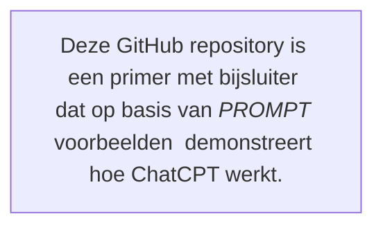
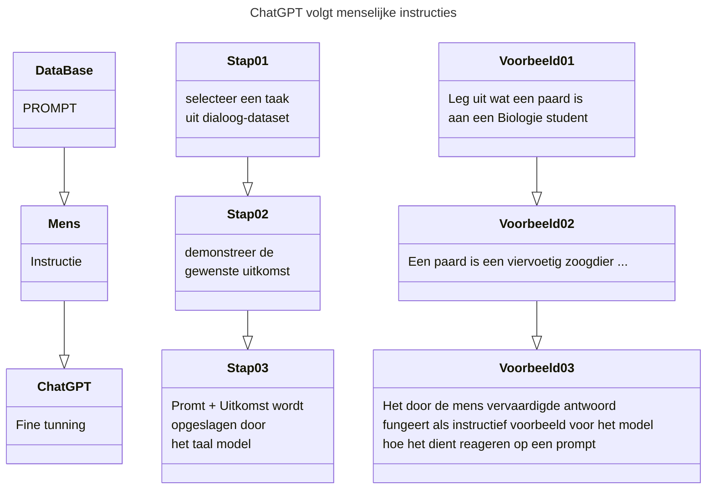

# AI's NEW FRONTIER is called Chat-GPT

***********

# PROMETHEUS   DATA SCIENCE LAB

***********

## Context & Doel

Exemplarisch voor AI anno 2023 is de lerende machine [ML] genaamd [ChatGPT](https://chat.openai.com/). Een state-of-the-art, grootschalig taalmodel [LLM] dat gebruik maakt van natuurlijke taalverwerkende [NLP] AI-technologie. 

Het is gevoed met meer dan 8 miljoen unieke dialogen.
ChatGPT’s gebruikersinterface is ontworpen om menselijke conversatie na te bootsen. 

Het revolutionaire aan deze AI-technologie zijn de ogenschijnlijk levensechte gesprekken die het kan onderhouden met mensen.

Deze GitHub repository is een ChatGPT primer met bijsluiter.
 

<!--

$${\color{blue} \fbox{Deze GitHub repository is een ChatGPT primer met bijsluiter.}}$$

-->
    

 

>Stel je een computer voor die jouw zinnen kan afmaken met een betere zinswending;  of een gesprek met je kan voeren over een thema dat jouw interesseert; of een probleem direct kan oplossen door honderden regels computercode te schrijven binnen enkele seconden. Een dergelijke computer vormt een schakel in een lange keten van werktuigen zoals het weefgetouw, de boekdrukpers en de stoommachine die de industriële revolutie opgang brachten. Tegelijkertijd is het onderdeel van een nieuwe klasse aan _lerende machines_, omdat het de symbolen in taal omzet & computercode schrijft op manieren die creatief lijken. Een beetje zoals een mens dat zou doen. 

    

*******
### [1] HOE LEREN COMPUTERS EEN GESPREK TE VOEREN?
*******

Een taalvaardig AI-model kan worden "gevraagd" om een taak uit te voeren op basis van tekstuele instructies.   Dit heet  *"prompting"* of *"priming"* in het Engelse taaldomein. 

Dit proces is vergelijkbaar met een Google zoekopdracht.   Het verschil is dat de uitkomst nu niet een verwijzing moet zijn naar een reeks relevante webpagina's,   maar een antwoord zoals een mens dat zou geven.

Om hieraan te voldoen moet de chatbot eerst worden getraind aan de hand van een grote hoeveelheid 
voorbeelden van deze taak in combinatie met menselijke feedback

Binnen het AI-domain wordt dit proces *"reinfored learning"* genoemd.   Het is een proces waarbij een taalmodel wordt aangepast aan een specifieke taak.   In dit geval het voeren van een gesprek.

 

   

Geraadpleegde bronnen: 
* Ouyang, L., Wu, J., Jiang, X., Almeida, D., Wainwright, C. L., Mishkin, P., Zhang, C., Agarwal, S., Slama, K., & Ray, A. (2022). Training language models to follow instructions with human feedback. arXiv. https://doi.org/10.48550/arXiv.2203.02155 
* OpenAI Guthub Repository: InstructGPT [Training Language Models to Follow Instructions with Human Feedback.](https://github.com/openai/following-instructions-human-feedback)

 

********
### [2] HOE GEEF IK EEN OPDRACHT AAN CHATGPT?

********

ChatGPT maakt gebruik van  *"prompting"* of *"priming"*. 

De prompt is de vraag , het verzoek of de vraag van de gebruiker in tekst-vorm. 

De prompt wordt vervolgens doorgegeven aan het model, die op zijn beurt hier op reageert in text-vorm, waarbij de gegenereerde tekst beetje bij beetje wordt vrijgegeven. 

De eindgebruiker krijgt zo de indruk dat het AI-model vragen beantwoordt en/of opdrachten uitvoert zoals een mens dat zou doen.

  

********
### [3] Kan ChatGPT uitleggen hoe het werkt?

********

| agent | prompt | agent | response |
----- | ----- | ----- | ----- |
| Human | Ben jij een voorbeeld van een generatief taalmodel AI? | ChatGPT |Ja, ik ben in staat om nieuwe tekst te genereren door het analyseren en leren van grote hoeveelheden aan tekst |
| Human | Maar alle antwoorden die je geeft zijn toch gebaseerd op voorbeelden uit een dialoog dataset + labelling + ranking door mensen? | ChatGPT | De antwoorden die ik geef zijn gebaseerd op de informatie die ik geleerd heb uit deze dataset en de manier waarop ik deze informatie interpreteer.      In sommige gevallen kan ik specifieke informatie uit de dataset gebruiken om te antwoorden op een vraag, in andere gevallen kan ik een combinatie van informatie gebruiken die ik geleerd heb om antwoord te geven.      Ook is het zo dat mijn antwoorden door mensen worden geëvalueerd en gerankt, en zo kan ik bijgestuurd worden of bijgeleerd. |
| Human | Wanneer je antwoorden gebaseerd zijn op een combinatie van informatie.      Waar bestaat die combinatie aan informatie (bronnen) dan uit? | ChatGPT |Als generatieve taalmodel, leer ik patronen en structuren in taal uit de dataset waarop ik getraind ben, zoals boeken, artikelen, websites enz.     Dit betekent dat de antwoorden die ik geef gebaseerd zijn op de informatie die ik geleerd heb uit deze dataset.     In sommige gevallen kan ik specifieke informatie uit de dataset gebruiken om te antwoorden op een vraag, in andere gevallen kan ik een combinatie van informatie gebruiken die ik geleerd heb om antwoord te geven.     Deze combinatie kan bestaan uit een aantal verschillende bronnen, zoals boeken, artikelen, websites of andere bronnen die in de dataset zijn opgenomen. |
| Human | Wanneer de uitkomst een combinatie is van reeds bestaande bronnen dan heb jezelf toch niets nieuws gegenereerd? | ChatGPT |Het is waar dat ik niet in staat ben om echt nieuwe informatie te genereren die niet in de dataset aanwezig was.     Wat ik wel kan doen is informatie combineren en gebruiken die ik geleerd heb uit de dataset om antwoord te geven op een vraag of een opdracht uit te voeren.     Dit kan lijken op het genereren van nieuwe informatie, maar in feite is het een combinatie van de informatie die al aanwezig was in de dataset. |

  

********
### [4] PROMPT VOORBEELDEN

********

                     

                     

                     

                     

