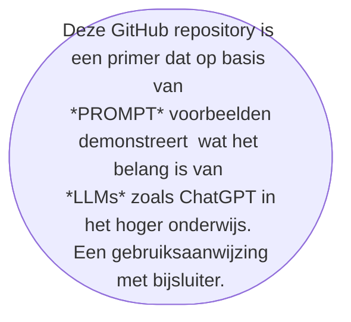

# AI's NEW FRONTIER is called Chat-GPT

***********

# PROMETHEUS   DATA SCIENCE LAB

***********
## Context & Doel

Exemplarisch voor AI anno 2023 is de lerende machine **––ML––** genaamd [ChatGPT](https://chat.openai.com/). Een state-of-the-art, grootschalig taalmodel **––LLM––** dat gebruik maakt van natuurlijke taalverwerkende **––NLP––** AI-technologie. Het is gevoed met meer dan 8 miljoen unieke dialogen.

   

*****

>Stel je een computer voor die jouw zinnen kan afmaken met een betere zinswending;  of een gesprek met je kan voeren over een thema dat jouw interesseert; of een probleem direct kan oplossen door honderden regels computercode te schrijven binnen enkele seconden. Een dergelijke computer vormt een schakel in een lange keten van werktuigen zoals het weefgetouw, de boekdrukpers en de stoommachine die de industriële revolutie opgang brachten. Tegelijkertijd is het onderdeel van een nieuwe klasse aan _lerende machines_, omdat het de symbolen in taal omzet & computercode schrijft op manieren die creatief lijken. Een beetje zoals een mens dat zou doen. 

Een testversie van ChatGPT  is op 30 november 2022 publiekelijk beschikbaar gesteld via de website van [OpenAI](https://chat.openai.com/), om uit te proberen door het voeren van “tekstuele dialogen”. 

 

*******
### BASIC PROMPTS

ChatGPT gebruikt een concept dat *"prompting"* of *"priming"* heet. 

De prompt is de vraag , het verzoek of de vraag van de gebruiker in tekst-vorm. 

De prompt wordt vervolgens doorgegeven aan het model, die op zijn beurt hier op reageert in text-vorm, waarbij de gegenereerde tekst beetje bij beetje wordt vrijgegeven. 

De eindgebruiker krijgt zo de indruk dat het AI-model vragen beantwoordt en/of opdrachten uitvoert zoals een mens dat zou doen.
