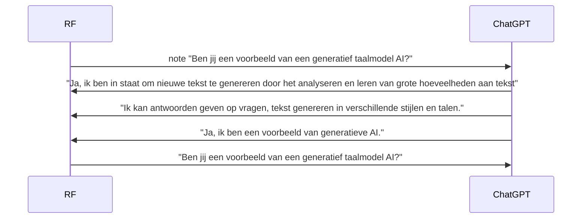

# AI's NEW FRONTIER is called Chat-GPT

***********

# PROMETHEUS   DATA SCIENCE LAB

***********

## Context & Doel

Exemplarisch voor AI anno 2023 is de lerende machine [ML] genaamd [ChatGPT](https://chat.openai.com/). Een state-of-the-art, grootschalig taalmodel [LLM] dat gebruik maakt van natuurlijke taalverwerkende [NLP] AI-technologie. 

Het is gevoed met meer dan 8 miljoen unieke dialogen.
ChatGPT’s gebruikersinterface is ontworpen om menselijke conversatie na te bootsen. Het revolutionaire aan deze AI-technologie zijn de ogenschijnlijk levensechte gesprekken die het kan onderhouden met mensen.

 

Deze GitHub repository is een primer met bijsluiter dat op basis van <i>prompt</i> voorbeelden  demonstreert hoe ChatCPT werkt.

<!--

-->
    

 

>Stel je een computer voor die jouw zinnen kan afmaken met een betere zinswending;  of een gesprek met je kan voeren over een thema dat jouw interesseert; of een probleem direct kan oplossen door honderden regels computercode te schrijven binnen enkele seconden. Een dergelijke computer vormt een schakel in een lange keten van werktuigen zoals het weefgetouw, de boekdrukpers en de stoommachine die de industriële revolutie opgang brachten. Tegelijkertijd is het onderdeel van een nieuwe klasse aan _lerende machines_, omdat het de symbolen in taal omzet & computercode schrijft op manieren die creatief lijken. Een beetje zoals een mens dat zou doen. 

    

*******
### [1] HOE LEREN COMPUTERS EEN GESPREK TE VOEREN?
*******

Een taalvaardig AI-model kan worden "gevraagd" om een taak uit te voeren op basis van tekstuele instructies.   Dit heet  *"prompting"* of *"priming"* in het Engelse taaldomein. 

Dit proces is vergelijkbaar met een Google zoekopdracht.   Het verschil is dat de uitkomst nu niet een verwijzing moet zijn naar een reeks relevante webpagina's,   maar een antwoord zoals een mens dat zou geven.

Om hieraan te voldoen moet de chatbot eerst worden getraind aan de hand van een grote hoeveelheid 
voorbeelden van deze taak in combinatie met menselijke feedback

Binnen het AI-domain wordt dit proces *"reinfored learning"* genoemd.   Het is een proces waarbij een taalmodel wordt aangepast aan een specifieke taak.   In dit geval het voeren van een gesprek.

 

   

Geraadpleegde bronnen: 
* Ouyang, L., Wu, J., Jiang, X., Almeida, D., Wainwright, C. L., Mishkin, P., Zhang, C., Agarwal, S., Slama, K., & Ray, A. (2022). Training language models to follow instructions with human feedback. arXiv. https://doi.org/10.48550/arXiv.2203.02155 
* OpenAI Guthub Repository: InstructGPT [Training Language Models to Follow Instructions with Human Feedback.](https://github.com/openai/following-instructions-human-feedback)

 

********
### [2] HOE GEEF IK EEN OPDRACHT AAN CHATGPT?

********

ChatGPT maakt gebruik van  *"prompting"* of *"priming"*. 

De prompt is de vraag , het verzoek of de vraag van de gebruiker in tekst-vorm. 

De prompt wordt vervolgens doorgegeven aan het model, die op zijn beurt hier op reageert in text-vorm, waarbij de gegenereerde tekst beetje bij beetje wordt vrijgegeven. 

De eindgebruiker krijgt zo de indruk dat het AI-model vragen beantwoordt en/of opdrachten uitvoert zoals een mens dat zou doen.

  

********
### Kan ChatGPT uitleggen wat het is?

********

### PROMPT VOORBEELDEN

********

                     

                     

                     

                     

